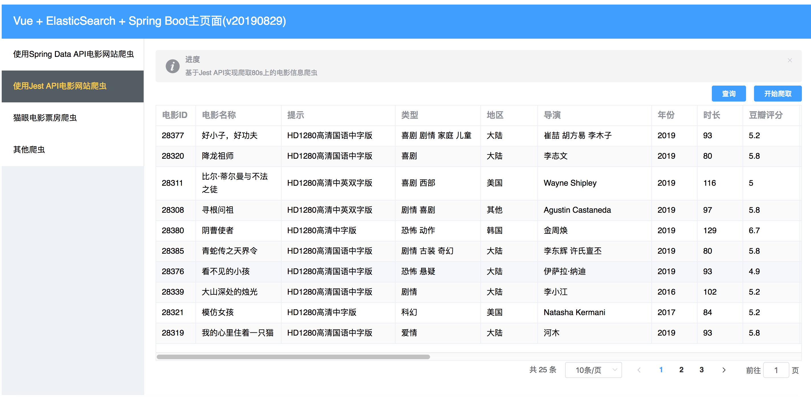

# 基于ElasticSearch6.8.2学习

## 计划及实现
目前计划从80s网站上进行爬虫，爬取电影信息，然后存储到ES中，并实现先关操作
目前实现：
1. 从80s网站爬虫电影信息
2. 页面的分页查询操作
3. 全部删除操作(底层可能只会删除1000条,有待研究)

## 描述
基于Docker环境运行的ElasticSearch6.8.2,目前项目中集成了2种Java API:
1. 使用Spring Data ElasticSearch 3.1.10
2. 使用Rest High Level Client 6.8.2


## 技术架构

1. JDK 1.8
2. Spring Boot 2.1.7
3. Spring 5.1.9
4. Tomcat 9.0.22
5. ElasticSearch 6.8.2
6. Spring Data ElasticSearch 3.1.10
7. Docker 18.09.1
8. Rest High Level Client 6.8.2
9. Vue2.6 + Element UI 2.11.1 +Axios

## 启动ElasticSearch服务

拉取ElasticSearch镜像
````
docker pull elasticsearch:6.8.2
````

创建容器并启动,指定内存512M，暴露9200与9300端口
````
docker run -e ES_JAVA_OPTS="-Xms512m -Xmx512m" -d -p 9200:9200 -p 9300:9300 --name study_es6 dbf758a9f11b
````
注意：该命令输入时未指定集群的名称，所以默认的名称为：docker-cluster，需要与项目中的application.yml文件中配置的一致


## 更改配置并启动

1. 对于使用ElasticSearchTemplate与Rest High Level Client的修改application.yml文件

执行StartMainApplication.java文件

````
  .   ____          _            __ _ _
 /\\ / ___'_ __ _ _(_)_ __  __ _ \ \ \ \
( ( )\___ | '_ | '_| | '_ \/ _` | \ \ \ \
 \\/  ___)| |_)| | | | | || (_| |  ) ) ) )
  '  |____| .__|_| |_|_| |_\__, | / / / /
 =========|_|==============|___/=/_/_/_/
 :: Spring Boot ::        (v2.1.7.RELEASE)

2019-08-10 12:53:10.601  INFO 11904 --- [  restartedMain] c.c.elasticsearch.StartMainApplication   : Starting StartMainApplication on longyu-mac.local with PID 11904 (/develop/IdeaWork/elasticsearchstudy/target/classes started by longyu in /develop/IdeaWork/elasticsearchstudy)
2019-08-10 12:53:10.604  INFO 11904 --- [  restartedMain] c.c.elasticsearch.StartMainApplication   : No active profile set, falling back to default profiles: default
2019-08-10 12:53:10.641  INFO 11904 --- [  restartedMain] .e.DevToolsPropertyDefaultsPostProcessor : Devtools property defaults active! Set 'spring.devtools.add-properties' to 'false' to disable
2019-08-10 12:53:10.641  INFO 11904 --- [  restartedMain] .e.DevToolsPropertyDefaultsPostProcessor : For additional web related logging consider setting the 'logging.level.web' property to 'DEBUG'
2019-08-10 12:53:11.119  INFO 11904 --- [  restartedMain] .s.d.r.c.RepositoryConfigurationDelegate : Bootstrapping Spring Data repositories in DEFAULT mode.
2019-08-10 12:53:11.137  INFO 11904 --- [  restartedMain] .s.d.r.c.RepositoryConfigurationDelegate : Finished Spring Data repository scanning in 13ms. Found 0 repository interfaces.
2019-08-10 12:53:11.605  INFO 11904 --- [  restartedMain] o.s.b.w.embedded.tomcat.TomcatWebServer  : Tomcat initialized with port(s): 7071 (http)
2019-08-10 12:53:11.626  INFO 11904 --- [  restartedMain] o.apache.catalina.core.StandardService   : Starting service [Tomcat]
2019-08-10 12:53:11.626  INFO 11904 --- [  restartedMain] org.apache.catalina.core.StandardEngine  : Starting Servlet engine: [Apache Tomcat/9.0.22]
2019-08-10 12:53:11.700  INFO 11904 --- [  restartedMain] o.a.c.c.C.[Tomcat].[localhost].[/]       : Initializing Spring embedded WebApplicationContext
2019-08-10 12:53:11.700  INFO 11904 --- [  restartedMain] o.s.web.context.ContextLoader            : Root WebApplicationContext: initialization completed in 1059 ms
2019-08-10 12:53:11.893  INFO 11904 --- [  restartedMain] o.elasticsearch.plugins.PluginsService   : no modules loaded
2019-08-10 12:53:11.894  INFO 11904 --- [  restartedMain] o.elasticsearch.plugins.PluginsService   : loaded plugin [org.elasticsearch.index.reindex.ReindexPlugin]
2019-08-10 12:53:11.894  INFO 11904 --- [  restartedMain] o.elasticsearch.plugins.PluginsService   : loaded plugin [org.elasticsearch.join.ParentJoinPlugin]
2019-08-10 12:53:11.894  INFO 11904 --- [  restartedMain] o.elasticsearch.plugins.PluginsService   : loaded plugin [org.elasticsearch.percolator.PercolatorPlugin]
2019-08-10 12:53:11.894  INFO 11904 --- [  restartedMain] o.elasticsearch.plugins.PluginsService   : loaded plugin [org.elasticsearch.script.mustache.MustachePlugin]
2019-08-10 12:53:11.894  INFO 11904 --- [  restartedMain] o.elasticsearch.plugins.PluginsService   : loaded plugin [org.elasticsearch.transport.Netty4Plugin]
2019-08-10 12:53:12.713  INFO 11904 --- [  restartedMain] o.s.d.e.c.TransportClientFactoryBean     : Adding transport node : 127.0.0.1:9300
2019-08-10 12:53:13.096  INFO 11904 --- [  restartedMain] o.s.s.concurrent.ThreadPoolTaskExecutor  : Initializing ExecutorService 'applicationTaskExecutor'
2019-08-10 12:53:13.459  INFO 11904 --- [  restartedMain] o.s.b.d.a.OptionalLiveReloadServer       : LiveReload server is running on port 35729
2019-08-10 12:53:13.498  INFO 11904 --- [  restartedMain] o.s.b.w.embedded.tomcat.TomcatWebServer  : Tomcat started on port(s): 7071 (http) with context path ''
2019-08-10 12:53:13.500  INFO 11904 --- [  restartedMain] c.c.elasticsearch.StartMainApplication   : Started StartMainApplication in 3.24 seconds (JVM running for 3.912)

````

## 测试访问

1. 对于测试使用ElasticSearchTemplate的:
````
http://localhost:7071/es/saveBook
...
````
2. 对于测试使用RestHighLevelClient的:
````
http://localhost:7071/highlevel/save
...
````
3. 对于访问主页面的(目前前端实现查询\爬虫\全部删除操作):
````
http://localhost:7071/
...
````
## 目前效果图

