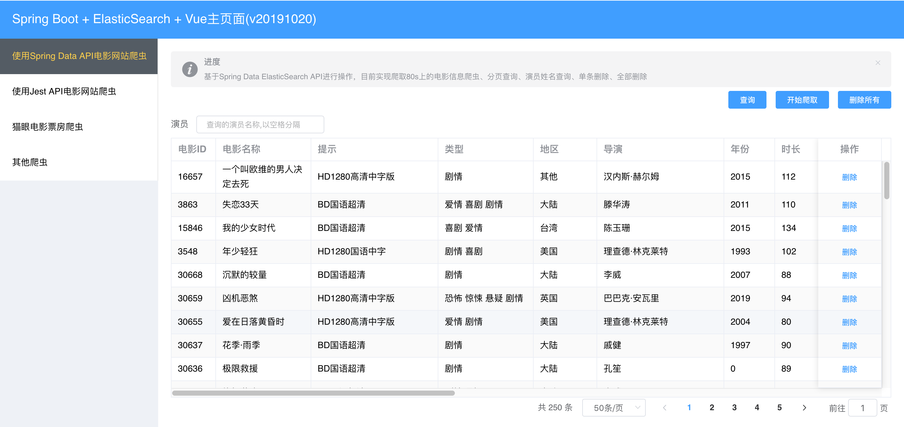
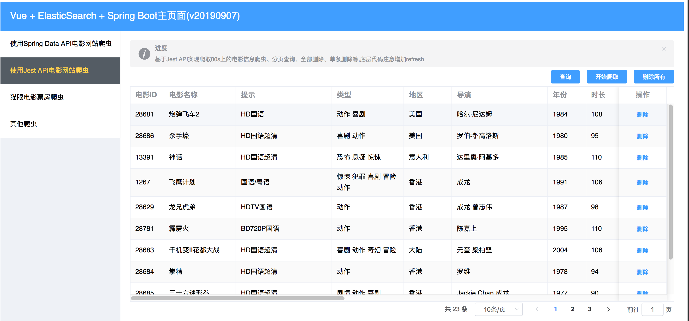

# 基于ElasticSearch6.8.2进行开发

## 项目描述
基于Docker环境运行的ElasticSearch6.8.2,目前项目中集成了3种与ElasticSearch交互的API:
1. 使用Spring Data ElasticSearch 3.2.0,需使用ES API为6.8.2
2. 使用Rest High Level Client 6.8.2
3. 使用Jest API 6.3.1

项目暂时未使用脚手架的方式开发Vue前端界面,采用了原始的方式进行开发

## 技术架构

1. JDK 1.8
2. Spring Boot 2.2.0
3. Spring 5.2.0
4. Tomcat 9.0.22
5. Docker 18.09.1
6. ElasticSearch API 6.8.2
7. Spring Data ElasticSearch 3.2.0
8. Rest High Level Client 6.8.2
9. Jest API 6.3.1
10. Vue2.6 + Vue Router + Element UI 2.11.1 + Axios + Qs


## Java API对比
|  API名称   | 端口  | 协议  | 说明  |
|  ----  | ----  | ----   | ----  |
|  Spring Data ElasticSearch   | 9300  | TCP  | 强依赖、上手容易、操作简单、依赖ES驱动包  |
|  Spring Data ElasticSearch   | 9200  | HTTP  | 强依赖、上手容易、操作简单、依赖ES驱动包,3.2版本开始  |
|  High Level RestClient  | 9200  | HTTP  |  官方推荐、依赖ES驱动包  |
|  Jest   | 9200  | HTTP  | 弱依赖、可以不使用ES的驱动包  |


## 计划及实现
计划：
1. 从80s网站\猫眼电影票房上进行爬虫，爬取电影信息，然后存储到ES中，并实现相关操作
2. TMDB

目前实现：
1. 从80s网站爬虫电影信息,使用Jsoup
2. 页面的分页查询操作,使用Spring Data ElasticSearch与Jest API
3. 全部删除操作
4. 单条删除操作
5. 根据演员信息进行查询(Spring Data ElasticSearch好使)

待计划：
1. 从猫眼电影票房信息上进行爬虫
2. 80s模块的一些基本操作
3. 一些查询条件学习: 拼音分词器,中文分词器,最佳匹配,多字段的查询,bool查询,multi_match
     

## 核心代码/业务/经验说明
1. 由于ES的写入和刷新机制,对文档进行写操作后,默认1s内进行查询不会实时看见数据,所以需要在API层面或代码层面进行控制,对于实时性要求较高的
2. 由于Spring Data ElasticSearch对ElasticSearch客户端的Java API较高,应按照官方推荐进行设置,这里将ES API更改为6.8.2
3. 对于演员字段来说，目前存储到数据库中的格式为多个空格分隔演员名称,那么为了能够被检索出来，需要设置该字段的分析器未whitespace,这样当搜索【刘德华】时才可以被检索出来
4. 默认情况下match的同一个字段被ES分词后,多个词为或者的关系，如果想查找某几个演员同时参与的电影信息,需要设置operator为and
````
 if(searchActors != null && searchActors.trim().length() > 0){
    BoolQueryBuilder boolQueryBuilder = QueryBuilders.boolQuery();
    boolQueryBuilder.must(QueryBuilders.matchQuery("actors",searchActors).operator(Operator.AND));
    queryBuilder = boolQueryBuilder;
 }
````

## 启动ElasticSearch服务

拉取ElasticSearch镜像
````
docker pull elasticsearch:6.8.2
````

创建容器并启动,指定内存512M，暴露9200与9300端口
````
docker run -e ES_JAVA_OPTS="-Xms512m -Xmx512m" -d -p 9200:9200 -p 9300:9300 --name study_es6 dbf758a9f11b
````
注意：该命令输入时未指定集群的名称，所以默认的名称为：docker-cluster，需要与项目中的application.yml文件中配置的一致

需要安装IK插件

## 更改配置并启动

1. 对于使用ElasticSearchTemplate与Rest High Level Client的修改application.yml文件

执行StartMainApplication.java文件

````
 
  .   ____          _            __ _ _
 /\\ / ___'_ __ _ _(_)_ __  __ _ \ \ \ \
( ( )\___ | '_ | '_| | '_ \/ _` | \ \ \ \
 \\/  ___)| |_)| | | | | || (_| |  ) ) ) )
  '  |____| .__|_| |_|_| |_\__, | / / / /
 =========|_|==============|___/=/_/_/_/
 :: Spring Boot ::        (v2.2.0.RELEASE)

2019-10-20 12:56:00.824  INFO 34789 --- [  restartedMain] c.c.elasticsearch.StartMainApplication   : Starting StartMainApplication on longyu-mac.local with PID 34789 (/develop/IdeaWork/elasticsearchstudy/target/classes started by longyu in /develop/IdeaWork/elasticsearchstudy)
2019-10-20 12:56:00.825  INFO 34789 --- [  restartedMain] c.c.elasticsearch.StartMainApplication   : No active profile set, falling back to default profiles: default
2019-10-20 12:56:00.968  INFO 34789 --- [  restartedMain] .s.d.r.c.RepositoryConfigurationDelegate : Bootstrapping Spring Data repositories in DEFAULT mode.
2019-10-20 12:56:00.973  INFO 34789 --- [  restartedMain] .s.d.r.c.RepositoryConfigurationDelegate : Finished Spring Data repository scanning in 4ms. Found 0 repository interfaces.
2019-10-20 12:56:00.974  INFO 34789 --- [  restartedMain] .s.d.r.c.RepositoryConfigurationDelegate : Bootstrapping Spring Data repositories in DEFAULT mode.
2019-10-20 12:56:00.979  INFO 34789 --- [  restartedMain] .s.d.r.c.RepositoryConfigurationDelegate : Finished Spring Data repository scanning in 4ms. Found 0 repository interfaces.
2019-10-20 12:56:01.034  WARN 34789 --- [  restartedMain] org.apache.tomcat.util.modeler.Registry  : The MBean registry cannot be disabled because it has already been initialised
2019-10-20 12:56:01.051  INFO 34789 --- [  restartedMain] o.s.b.w.embedded.tomcat.TomcatWebServer  : Tomcat initialized with port(s): 7071 (http)
2019-10-20 12:56:01.052  INFO 34789 --- [  restartedMain] o.apache.catalina.core.StandardService   : Starting service [Tomcat]
2019-10-20 12:56:01.052  INFO 34789 --- [  restartedMain] org.apache.catalina.core.StandardEngine  : Starting Servlet engine: [Apache Tomcat/9.0.27]
2019-10-20 12:56:01.058  INFO 34789 --- [  restartedMain] o.a.c.c.C.[Tomcat].[localhost].[/]       : Initializing Spring embedded WebApplicationContext
2019-10-20 12:56:01.058  INFO 34789 --- [  restartedMain] o.s.web.context.ContextLoader            : Root WebApplicationContext: initialization completed in 231 ms
2019-10-20 12:56:01.073  INFO 34789 --- [  restartedMain] o.elasticsearch.plugins.PluginsService   : no modules loaded
2019-10-20 12:56:01.073  INFO 34789 --- [  restartedMain] o.elasticsearch.plugins.PluginsService   : loaded plugin [org.elasticsearch.index.reindex.ReindexPlugin]
2019-10-20 12:56:01.074  INFO 34789 --- [  restartedMain] o.elasticsearch.plugins.PluginsService   : loaded plugin [org.elasticsearch.join.ParentJoinPlugin]
2019-10-20 12:56:01.074  INFO 34789 --- [  restartedMain] o.elasticsearch.plugins.PluginsService   : loaded plugin [org.elasticsearch.percolator.PercolatorPlugin]
2019-10-20 12:56:01.074  INFO 34789 --- [  restartedMain] o.elasticsearch.plugins.PluginsService   : loaded plugin [org.elasticsearch.script.mustache.MustachePlugin]
2019-10-20 12:56:01.074  INFO 34789 --- [  restartedMain] o.elasticsearch.plugins.PluginsService   : loaded plugin [org.elasticsearch.transport.Netty4Plugin]
2019-10-20 12:56:01.084  INFO 34789 --- [  restartedMain] o.s.d.e.c.TransportClientFactoryBean     : Adding transport node : 127.0.0.1:9300
2019-10-20 12:56:01.122  INFO 34789 --- [  restartedMain] io.searchbox.client.AbstractJestClient   : Setting server pool to a list of 1 servers: [http://127.0.0.1:9200]
2019-10-20 12:56:01.122  INFO 34789 --- [  restartedMain] io.searchbox.client.JestClientFactory    : Using multi thread/connection supporting pooling connection manager
2019-10-20 12:56:01.123  INFO 34789 --- [  restartedMain] io.searchbox.client.JestClientFactory    : Using custom GSON instance
2019-10-20 12:56:01.123  INFO 34789 --- [  restartedMain] io.searchbox.client.JestClientFactory    : Node Discovery disabled...
2019-10-20 12:56:01.123  INFO 34789 --- [  restartedMain] io.searchbox.client.JestClientFactory    : Idle connection reaping disabled...
2019-10-20 12:56:01.144  INFO 34789 --- [  restartedMain] o.s.b.d.a.OptionalLiveReloadServer       : LiveReload server is running on port 35729
--------------初始化时创建索引movie
2019-10-20 12:56:01.190  INFO 34789 --- [  restartedMain] o.s.s.concurrent.ThreadPoolTaskExecutor  : Initializing ExecutorService 'applicationTaskExecutor'
2019-10-20 12:56:01.201  INFO 34789 --- [  restartedMain] o.s.b.a.w.s.WelcomePageHandlerMapping    : Adding welcome page: class path resource [static/index.html]
2019-10-20 12:56:01.235  INFO 34789 --- [  restartedMain] o.s.b.w.embedded.tomcat.TomcatWebServer  : Tomcat started on port(s): 7071 (http) with context path ''
2019-10-20 12:56:01.235  INFO 34789 --- [  restartedMain] c.c.elasticsearch.StartMainApplication   : Started StartMainApplication in 0.573 seconds (JVM running for 4787.312)
2019-10-20 12:56:01.236  INFO 34789 --- [  restartedMain] .ConditionEvaluationDeltaLoggingListener : Condition evaluation unchanged

````

## 测试访问

1. 对于测试使用ElasticSearchTemplate的:
````
http://localhost:7071/es/saveBook
...
````
2. 对于测试使用RestHighLevelClient的:
````
http://localhost:7071/highlevel/save
...
````
3. 对于访问主页面的(目前前端实现查询\爬虫\全部删除操作):
````
http://localhost:7071/
...
````
## 目前效果图
1. 基于Spring Data API的截图

2. 基于Jest API的截图

