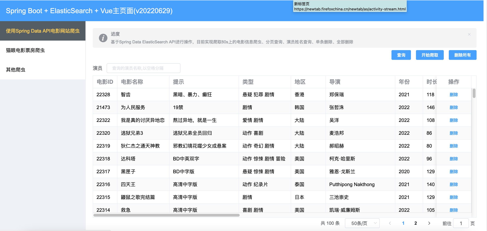
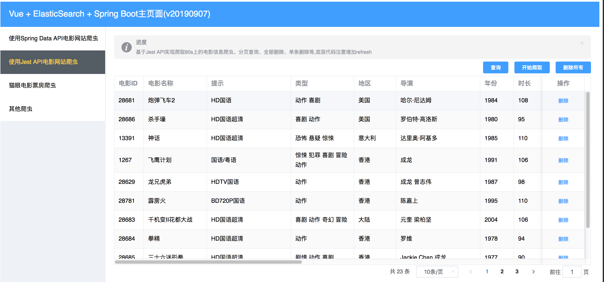

# 基于ElasticSearch7.17.4进行开发

## 项目描述
基于Docker环境运行的ElasticSearch7.17.4,目前项目中集成了2种与ElasticSearch交互的API:
1. 使用Spring Data ElasticSearch 4.2.5,需使用ES API为7.12.1
3. 使用Jest API 6.3.1

项目暂时未使用脚手架的方式开发Vue前端界面,采用了原始的方式进行开发

## 技术架构

1. JDK 1.8
2. Spring Boot 2.5.5
3. Spring 5.3.10
4. Tomcat 9.0.53
5. Docker 20.10
6. ElasticSearch API 7.12.1
7. Spring Data ElasticSearch 4.2.5
8. Jest API 6.3.1
9. Vue2.6 + Vue Router + Element UI 2.11.1 + Axios + Qs


## Java API对比
|  API名称   | 端口  | 协议  | 说明  |
|  ----  | ----  | ----   | ----  |
|  Spring Data ElasticSearch   | 9200  | HTTP  | 强依赖、上手容易、操作简单、依赖ES驱动包,3.2版本开始  |
|  Jest   | 9200  | HTTP  | 弱依赖、可以不使用ES的驱动包  |


## 计划及实现
计划：
1. 从80s网站\猫眼电影票房上进行爬虫，爬取电影信息，然后存储到ES中，并实现相关操作
2. TMDB

目前实现：
1. 从80s网站爬虫电影信息,使用Jsoup
2. 页面的分页查询操作,使用Spring Data ElasticSearch与Jest API
3. 全部删除操作
4. 单条删除操作
5. 根据演员信息进行查询(Spring Data ElasticSearch好使)

待计划：
1. 从猫眼电影票房信息上进行爬虫
2. 80s模块的一些基本操作
3. 一些查询条件学习: 拼音分词器,中文分词器,最佳匹配,多字段的查询,bool查询,multi_match
     

## 核心代码/业务/经验说明
1. 由于ES的写入和刷新机制,对文档进行写操作后,默认1s内进行查询不会实时看见数据,所以需要在API层面或代码层面进行控制,对于实时性要求较高的
2. 由于Spring Data ElasticSearch对ElasticSearch客户端的Java API较高,应按照官方推荐进行设置,这里将ES API更改为6.8.2
3. 对于演员字段来说，目前存储到数据库中的格式为多个空格分隔演员名称,那么为了能够被检索出来，需要设置该字段的分析器未whitespace,这样当搜索【刘德华】时才可以被检索出来
4. 默认情况下match的同一个字段被ES分词后,多个词为或者的关系，如果想查找某几个演员同时参与的电影信息,需要设置operator为and
````
 if(searchActors != null && searchActors.trim().length() > 0){
    BoolQueryBuilder boolQueryBuilder = QueryBuilders.boolQuery();
    boolQueryBuilder.must(QueryBuilders.matchQuery("actors",searchActors).operator(Operator.AND));
    queryBuilder = boolQueryBuilder;
 }
````

## 启动ElasticSearch服务

拉取ElasticSearch镜像
````
docker pull elasticsearch:7.17.4
````

创建容器并启动,指定内存512M，暴露9200与9300端口
````
docker run -e ES_JAVA_OPTS="-Xms512m -Xmx512m" -e "discovery.type=single-node" -d -p 9200:9200 -p 9300:9300 --name study_es7 elasticsearch:7.17.4
````
注意：该命令输入时未指定集群的名称，所以默认的名称为：docker-cluster，需要与项目中的application.yml文件中配置的一致

需要安装IK插件

## 更改配置并启动

1. 对于使用ElasticSearchRestTemplate修改application.yml文件

执行StartMainApplication.java文件

````
Connected to the target VM, address: '127.0.0.1:61026', transport: 'socket'

  .   ____          _            __ _ _
 /\\ / ___'_ __ _ _(_)_ __  __ _ \ \ \ \
( ( )\___ | '_ | '_| | '_ \/ _` | \ \ \ \
 \\/  ___)| |_)| | | | | || (_| |  ) ) ) )
  '  |____| .__|_| |_|_| |_\__, | / / / /
 =========|_|==============|___/=/_/_/_/
 :: Spring Boot ::                (v2.5.5)

2022-06-29 01:10:32.094  INFO 7500 --- [  restartedMain] c.c.elasticsearch.StartMainApplication   : Starting StartMainApplication using Java 1.8.0_333 on MacBook-Pro.local with PID 7500 (/Users/longyu/data/develop/gitee/elasticsearch-study/target/classes started by longyu in /Users/longyu/data/develop/gitee/elasticsearch-study)
2022-06-29 01:10:32.101  INFO 7500 --- [  restartedMain] c.c.elasticsearch.StartMainApplication   : No active profile set, falling back to default profiles: default
2022-06-29 01:10:32.204  INFO 7500 --- [  restartedMain] .e.DevToolsPropertyDefaultsPostProcessor : Devtools property defaults active! Set 'spring.devtools.add-properties' to 'false' to disable
2022-06-29 01:10:32.205  INFO 7500 --- [  restartedMain] .e.DevToolsPropertyDefaultsPostProcessor : For additional web related logging consider setting the 'logging.level.web' property to 'DEBUG'
2022-06-29 01:10:33.362  INFO 7500 --- [  restartedMain] .s.d.r.c.RepositoryConfigurationDelegate : Bootstrapping Spring Data Elasticsearch repositories in DEFAULT mode.
2022-06-29 01:10:33.400  INFO 7500 --- [  restartedMain] .s.d.r.c.RepositoryConfigurationDelegate : Finished Spring Data repository scanning in 28 ms. Found 0 Elasticsearch repository interfaces.
2022-06-29 01:10:33.409  INFO 7500 --- [  restartedMain] .s.d.r.c.RepositoryConfigurationDelegate : Bootstrapping Spring Data Reactive Elasticsearch repositories in DEFAULT mode.
2022-06-29 01:10:33.425  INFO 7500 --- [  restartedMain] .s.d.r.c.RepositoryConfigurationDelegate : Finished Spring Data repository scanning in 15 ms. Found 0 Reactive Elasticsearch repository interfaces.
2022-06-29 01:10:34.544  INFO 7500 --- [  restartedMain] o.s.b.w.embedded.tomcat.TomcatWebServer  : Tomcat initialized with port(s): 7071 (http)
2022-06-29 01:10:34.565  INFO 7500 --- [  restartedMain] o.apache.catalina.core.StandardService   : Starting service [Tomcat]
2022-06-29 01:10:34.565  INFO 7500 --- [  restartedMain] org.apache.catalina.core.StandardEngine  : Starting Servlet engine: [Apache Tomcat/9.0.53]
2022-06-29 01:10:34.741  INFO 7500 --- [  restartedMain] o.a.c.c.C.[Tomcat].[localhost].[/]       : Initializing Spring embedded WebApplicationContext
2022-06-29 01:10:34.741  INFO 7500 --- [  restartedMain] w.s.c.ServletWebServerApplicationContext : Root WebApplicationContext: initialization completed in 2529 ms
2022-06-29 01:10:36.492  INFO 7500 --- [  restartedMain] o.s.b.d.a.OptionalLiveReloadServer       : LiveReload server is running on port 35729
2022-06-29 01:10:36.693  WARN 7500 --- [  restartedMain] org.elasticsearch.client.RestClient      : request [GET http://localhost:9200/] returned 1 warnings: [299 Elasticsearch-7.17.4-79878662c54c886ae89206c685d9f1051a9d6411 "Elasticsearch built-in security features are not enabled. Without authentication, your cluster could be accessible to anyone. See https://www.elastic.co/guide/en/elasticsearch/reference/7.17/security-minimal-setup.html to enable security."]
2022-06-29 01:10:36.769  INFO 7500 --- [  restartedMain] o.s.d.elasticsearch.support.VersionInfo  : Version Spring Data Elasticsearch: 4.2.5
2022-06-29 01:10:36.772  INFO 7500 --- [  restartedMain] o.s.d.elasticsearch.support.VersionInfo  : Version Elasticsearch Client in build: 7.12.1
2022-06-29 01:10:36.772  INFO 7500 --- [  restartedMain] o.s.d.elasticsearch.support.VersionInfo  : Version Elasticsearch Client used: 7.12.1
2022-06-29 01:10:36.772  INFO 7500 --- [  restartedMain] o.s.d.elasticsearch.support.VersionInfo  : Version Elasticsearch cluster: 7.17.4
2022-06-29 01:10:36.772  WARN 7500 --- [  restartedMain] o.s.d.elasticsearch.support.VersionInfo  : Version mismatch in between Elasticsearch Client and Cluster: 7.12.1 - 7.17.4
2022-06-29 01:10:37.260  INFO 7500 --- [  restartedMain] o.s.b.a.w.s.WelcomePageHandlerMapping    : Adding welcome page: class path resource [static/index.html]
2022-06-29 01:10:37.488  INFO 7500 --- [  restartedMain] o.s.b.w.embedded.tomcat.TomcatWebServer  : Tomcat started on port(s): 7071 (http) with context path ''
2022-06-29 01:10:37.506  INFO 7500 --- [  restartedMain] c.c.elasticsearch.StartMainApplication   : Started StartMainApplication in 6.361 seconds (JVM running for 8.711)

````

## 测试访问

1. 对于测试使用ElasticSearchRestTemplate的:
````
http://localhost:7071/es/saveBook
...
````
2对于访问主页面的(目前前端实现查询\爬虫\全部删除操作):
````
http://localhost:7071/
...
````
## 目前效果图
1. 基于Spring Data ElasticSearch API的截图

2. 基于Jest API的截图

